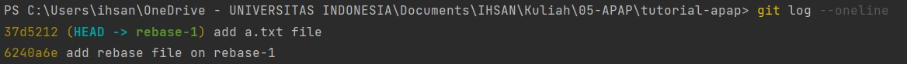

# Tutorial APAP

## Authors

* **Muhammad Ihsan Al Farisi** - *2006596693* - *APAP-B*

---
## Tutorial 7
**Pertanyaan 1: Jelaskan secara singkat perbedaan Otentikasi dan Otorisasi! Di bagian mana (dalam kode yang telah anda 
buat) konsep tersebut diimplementasi?**
> Otentikasi merupakan suatu sistem yang berfungsi untuk memastikan siapa saja yang berhak menggunakan sistem informasi.
> Mekanisme otentikasi ini diterapkan pada WebSecurityConfig pada package security yakni pengaturan akses login 
> (penggunaan password). Sedangkan, otorisasi merupakan suatu sistem yang berfungsi untuk memberikan batasan kepada
> pengguna. Mekanisme otorisasi pada kode ini merupakan pembatasan pengguna berdasarkan role-nya, akses listUser kepada
> Admin dan tambahPenyelenggara kepada Manajer.

**Pertanyaan 2: Apa itu BCryptPasswordEncoder? Jelaskan secara singkat cara kerja dan tujuannya.**
> BCryptPasswordEncoder merupakan tool yang dapat digunakan untuk men-encode password. Ketika menambahkan user, 
> BCryptPasswordEncoder berperan untuk melakukan hashing pada password untuk disimpan ke database.

**Pertanyaan 3: Apakah penyimpanan password sebaiknya menggunakan encryption atau hashing? Mengapa demikian?**
> Proses pembuatan user, terkhusus pada penyimpanan password menurut saya akan lebih baik dengan menggunakan hashing
> dibandingkan dengan encryption. Penggunaan encryption hanya mengubah password menjadi text yang sulit dibaca 
> (ciphertext) dan hal tersebut dapat dengan mudah diubah kembali apabila terdapat encription key.

**Pertanyaan 4: Jelaskan secara singkat apa itu UUID beserta penggunaannya!**
> UUID merupakan tool yang digunakan untuk security. UUID adalah kode sebanyak 32 karakter yang diambil dari timestamp
> dan alamat MAC komputer. Tujuan dari UUID sendiri adalah untuk menjamin id yang di-generate bersifat unik.

**Pertanyaan 5: Apa kegunaan class UserDetailsServiceImpl.java? Mengapa harus ada class tersebut?**
> Class UserDetailsServiceImpl berfungsi untuk memberikan informasi terkait status otentikasi dan otorisasi user pada
> class-class lain. Apabila class ini tidak terimplementasi, maka informasi terkait hal tersebut tidak dapat diberikan.

## Tutorial 6
**Pertanyaan 1: Perhatikan apa yang terjadi pada file index.html pada branch feat/tutorial-6-advancedgit-1. 
Apa yang terjadi setelah git cherry-pick dilakukan? Apakah kita bisa melakukan cherrypick tanpa harus melakukan commit?**
> File index.html pada branch feat/tutorial-6-advancedgit-1 yang tadinya kosong sekarang terisi setelah dilakukan ```git
> cherry-pick```, hal ini dapat terjadi karena ```git cherry-pick``` memungkinkan kita untuk mengambil kode dari branch 
> lain. Pada contoh ini, yang diambil merupakan baris kode dari branch tut-for-cherrypick ke 
> feat/tutorial-6-advancedgit-1. Selain itu, kita juga dapat melakukan cherrypick tanpa melakukan commit dengan 
> menambahkan ```-n```. ```git cherry-pick -n <commit-id>```.

**Pertanyaan 2: Conflict terjadi karena ...**
> Konflik terjadi karena terdapat perbedaan pada baris 6 file index.html. Konflik muncul sebagai ekspresi git yang
> tidak tahu harus menggunakan kode yang mana (karena berbeda antara satu dan yang lain). Maka, kita diminta untuk 
> me-resolve konflik ini dengan mengedit file yang berkaitan, dalam hal ini file index.html. Setelah itu, kita perlu 
> melakukan ```git add``` dan ```git merge --continue```.

**Pertanyaan 3: Apa yang terjadi pada log history setelah melakukan rebase (branch rebase-1 dan rebase-2)? 
Sertakan screenshot log history anda pada kedua branch tersebut!**

----

> Pada foto di atas dapat dilihat bahwa pada rebase-2 terdapat log history rebase-1. Hal ini dapat terjadi karena ```git rebase```
> memungkinkan kita untuk menambahkan log history dari satu branch ke branch lainnya.


**Pertanyaan 4: Jelaskan perbedaan dari "rebase –continue", "rebase –skip", dan "rebase –abort"!**
> - ```rebase -continue``` berfungsi untuk melanjutkan rebase setelah resolve conflict.
> - ```rebase -skip``` berfungsi untuk mengabaikan konflik yang terjadi/muncul.
> - ```rebase -abort``` berfungsi untuk membatalkan rebase.

**Pertanyaan 5: Jelaskan perbedaan git rebase dan git merge!**
> ```git merge``` dan ```git rebase``` memiliki fungsi yang sama yaitu untuk memberikan perubahan pada branch tertentu. Namun, terdapat
> perbedaan dari keduanya. Git merge melakukan penambahan commit/history, sedangkan git rebase melakukan replacing 
> commit/history. 
> - Karakteristik Merge: mempertahankan history repo, mudah diperbaiki jika ada konflik
> - Karakteristik Rebase: membuat history repo menjadi lebih bersih, memudahkan kita untuk membaca grafik commit 

**Pertanyaan 6: Pada tahap ini apakah yang terjadi pada direktori git-stash?**
> Pada saat dilakukan ```git stash```, direktori git-stash akan terhapus. Kita dapat memindahkan direktori git-stash
> dengan melakukan ```git stahs pop``` pada branch yang diinginkan.

**Pertanyaan 7: Apa yang terjadi pada file abc.txt setelah melakukan git reset --hard? Bagaimana kondisi lognya? 
Apa perbedaan git reset dengan git revert?**
> Isi file abc.txt yang tadinya berisi 2 baris, kembali menjadi 1 baris karena ```git reset``` yang mengembalikan file
> abc.txt ke commit "update abc file", yang awalnya "update abc file 2". ```git reset``` sendiri berfungsi untuk mengembalikan
> state dari titik commit tertentu, sedangkan ```git revert``` berfungsi untuk membuat commit baru yang dapat meng-undo
> perubahan karena commit.

## Tutorial 5
**Pertanyaan 1: Apa itu Postman? Apa kegunaannya?**
> **_Postman_** merupakan aplikasi komputer yang digunakan untuk melakukan pengujian API. Aplikasi ini relatif mudah digunakan
> karena memiliki fitur yang sangat memudahkan seperti pengguna hanya perlu mengisi data yang diperlukan dan memilih
> metode HTTP dan keran "Send" untuk melakukan pengiriman.

**Pertanyaan 2: Jelaskan fungsi dari anotasi @JsonIgnoreProperties dan @JsonProperty.**
> - **_@JsonIgnoreProperties_** digunakan untuk mengabaikan properti-properti. Digunakan dengan cara memasukkan nama properti
> ingin diabaikan pada parameternya. 
> 
>   **Contoh:** @JsonIgnoreProperties(value={"listPenyelenggara"}, allowSetters = true) digunakan untuk mengabaikan
>   properti "listPenyelenggara".
> - _**@JsonProperty**_ digunakan untuk mengganti nama dari suatu properti.

**Pertanyaan 3: Apa kegunaan atribut WebClient?**
> Atribut WebClient digunakan sebagai titik utama pengiriman dan penerimaan data dari web.

**Pertanyaan 4: Apa itu ResponseEntity dan BindingResult? Apa kegunaannya?**
> - **_ResponseEntity_** berfungsi untuk merepresentasikan keseluruhan HTTP response (status, headers, dan body).
> - **_BindingResult_** merupakan suatu objek Spring berfungsi untuk mengikat hasil dan memvalidasi data apabila terjadi
> error/kesalahan.

## Tutorial 4
**Pertanyaan 1: Jelaskan perbedaan th:include dan th:replace!**
> th:include digunakan untuk menggantikan konten yang ada pada tags, contohnya
> ```<object th:include="fragments/fragment :: css" th:remove="tag"></object>```
> yang mana isi dari "fragment/fragment :: css" akan mengisi object. Sedangkan untuk th:replace, seluruh kode pada tags 
> tersebut akan digantikan dengan yang di-replace.

**Pertanyaan 2: Jelaskan apa fungsi dari th:object!**
> th:object memiliki fungsi untuk mengikat object. Dengan begitu, kita dimungkinkan untuk melakukan pemanggilan terhadap
> suatu objek dari file-file tertentu agar dapat diimplementasikan pada file lain.

**Pertanyaan 3: Jelaskan perbedaan dari * dan $ pada saat penggunaan th:object! Kapan harus dipakai?**
> '*' digunakan untuk menunjuk suatu atribut dari suatu objek, sedangkan '$' digunakan untuk menunjuk objek itu sendiri.

## Tutorial 3
**Pertanyaan 1: Tolong jelaskan secara singkat apa kegunaan dari anotasi-anotasi yang ada pada model (@AllArgsConstructor,
@NoArgsConstructor, @Setter, @Getter, @Entity, @Table)**
> - @AllArgsConstructor: Membuat constructor dengan skala public dengan atributnya yang terisi secara otomatis
> - @NoArgsConstructor: Men-generate constructor tanpa membutuhkan parameter/tanpa mengisi atributnya
> - @Setter: Melakukan inject untuk class tertentu menggunakan method setter
> - @Getter: Melakukan inject untuk class tertentu menggunakan method getter
> - @Entity: Menetapkan bahwa setiap class adalah sebuah entitas yang akan dipetakan ke dalam database dan setiap instance dari suatu entitas merepresentasikan baris pada tabel
> - @Table: Memetakan detail dari tabel yang akan digunakan di dalam database


**Pertanyaan 2: Pada class CourseDb, terdapat method findByCodeUsingQuery dan findByCode, apakah perbedaan kedua method tersebut?
Jelaskan juga kegunaan @Query pada method findByCodeUsingQuery!**
>

**Pertanyaan 3: Jelaskan perbedaan kegunaan dari anotasi @JoinTable dan @JoinColumn**
> - @JoinTable berguna untuk menetapkan nama tabel berdasarkan nama atribut dan menyimpan id dari tabel yang berbeda.
> - @JoinColumn berguna untuk melakukan multiple join pada setiap kolom yang dituju dan menyimpan id dari tabel lain di kolom baru.


**Pertanyaan 4: Pada class Pengajar, digunakan anotasi @JoinColumn pada atribut Course, apa kegunaan dari name,
referencedColumnName, dan nullable dalam anotasi tersebut? dan apa perbedaan nullable dan penggunaan anotasi @NotNull**
> - Di dalam @JoinColumn terdapat beberapa parameter: name untuk merujuk pada foreign key/kolom yang akan direferensikan ke primary key, referencedColumnName merujuk pada primary key/kolom yang direferensikan oleh foreign key, nullable merujuk apakan foreign key null atau tidak.
> - @Nullable berguna untuk mengecek nullability pada setiap parameter sedangkan notnull mengecek nullability berdasarkan pemberian nilai true atau false.

**Pertanyaan 5: Jelaskan kegunaan FetchType.LAZY, CascadeType.ALL, dan FetchType.EAGER**
> FetchType.LAZY akan mengambil data sesuai permintaan
> FetchType.EAGER akan mengambil data secara bersamaan dengan fieldnya
> CascadeType.ALL berguna untuk menerapkan seluruh method CASCADE yang juga akan memengaruhi perubahannya pada entity child.

## Tutorial 2
**Pertanyaan 1: Cobalah untuk menambahkan sebuah Course dengan mengakses link berikut: 
http://localhost:8080/course/add?code=APAP&nameCourse=APAP%20Tutorial2&description=2020%20Fasilkom&jumlahSks=3.
Apa yang terjadi? Jelaskan mengapa hal tersebut dapat terjadi**
> Terjadi unexpected error. Hal ini terjadi karena templates "add-course" yang di-return oleh method addCourse tidak 
> ditemukan.


**Pertanyaan 2: Menurut kamu anotasi @Autowired pada class Controller tersebut merupakan implementasi dari konsep apa? 
Dan jelaskan secara singkat cara kerja @Autowired tersebut dalam konteks service dan controller yang telah kamu buat**
>Anotasi @Autowired pada class Controller mengimplementasikan konsep Injection. Anotasi tersebut memungkinkan kita sistem
> untuk menginjeksikan dependecies ke beans pada aplikasi. Pada aplikasi ini, @Autowired berfungsi untuk menginjeksikan
> dependencies pada CourseService agar dapat digunakan pada Controller.

**Pertanyaan 3: Cobalah untuk menambahkan sebuah Course dengan mengakses link berikut: 
http://localhost:8080/course/add?code=APAP&nameCourse=APAP%20Tutorial2&jumlahSks=3. Apa yang terjadi? Jelaskan mengapa 
hal tersebut dapat terjadi.**
> Seperti yang dapat dilihat pada gambar di bawah, penambahan Course gagal karena terdapat atribut yang tidak diisi 
> yaitu atribut description. Sistem tidak menghandle jenis penambahan Course dengan masukkan atribut yang tidak lengkap.


**Pertanyaan 4: Jika Papa APAP ingin melihat Course dengan kode APAP, link apa yang harus diakses?**
> Untuk melihat Course dengan kode **APAP**, kita dapat mengakses link sebagai berikut: 
> **http://localhost:8080/course/view?code=APAP**. Dengan catatan course dengan code terlampir telah ditambahkan.


**Pertanyaan 5: Tambahkan 1 contoh Course lainnya sesukamu. Lalu cobalah untuk mengakses 
http://localhost:8080/course/viewAll  , apa yang akan ditampilkan? Sertakan juga bukti screenshotmu.**
> Saya membuat Course lain dengan membuat dan mengakses 
> http://localhost:8080/course/add?code=Stater&nameCourse=Stater20/23&description=Fasilkom2020&jumlahSks=3.


## Tutorial 1
### What I have learned today
(Masukkan pertanyaan yang diikuti jawaban di setiap nomor, contoh seperti dibawah. Anda
juga boleh menambahkan catatan apapun di bagian ini)
### GitLab

1. Apa itu Issue Tracker? Apa saja masalah yang dapat diselesaikan dengan Issue Tracker?
   > Issue Tracker berguna untuk menulusuri isu-isu yang terjadi dalam pengembangan aplikasi. 
   > Issue Tracker dapat membantu pengembang untuk menemukan permasalahan beserta solusinya karena semuanya telah 
   > tertulis secara terstruktur. Hal ini tentu sangat berguna apabila pengembang membutuhkan solusi untuk masalah 
   > yang pernah terjadi sebelumnya sehingga proses pengembangan dapat berjalan dengan lebih efektif dan efisien.

2. Apa perbedaan dari git merge dan git merge --squash?
   > Git merge merupakan suatu perintah yang berfungsi untuk menyalin seluruh commit dari satu branch ke branch lainnya.
   > Sedangkan, git merge --squash merupakan suatu perintah untuk menggabungkan seluruh branch menjadi satu kemudian 
   > ditambahkan kepada branch lainnya.

3. Apa keunggulan menggunakan Version Control System seperti Git dalam pengembangan suatu aplikasi?
   > Penggunaan Version Control System seperti Git membawa beberapa keunggulan seperti:
    >- Pengembangan kode yang kolaboratif
    >- Pengembalian kode ke keadaan sebelumnya (apabila terdapat kesalahan)
    >- Membandingkan perubahan yang dilakukan dari waktu ke waktu

### Spring

4. Apa itu library & dependency?
    >- Library merupakan kumpulan kode yang dapat digunakan untuk fungsi-fungsi tertentu secara spesifik.
    >- Dependency, seperti namanya, merupakan suatu ketergantungan suatu program terhadap suatu komponen lainnya.

5. Apa itu Gradle? Mengapa kita menggunakan Gradle? Apakah ada alternatif dari Gradle?
   > Gradle  merupakan program yang dapat memudahkan pengerjaan pengembang dalam mengembangan suatu software. Contohnya
   > seperti untuk membuild dan mengompilasi kode secara otomatis. Dengan fungsi tersebut tentu kita membutuhkan gradle 
   > dalam pengembangan aplikasi agar lebih cepat.

6. Selain untuk pengembangan web, apa saja yang bisa dikembangkan dengan Spring framework?
    >- Database
    >- Apliaksi enterprise

   Dan produk-produk lainnya yang menggunakan JAVA serta membutuhkan automasi dalam pengerjaannya.

7. Apa perbedaan dari @RequestParam dan @PathVariable? Kapan sebaiknya menggunakan @RequestParam atau @PathVariable?
    >- @RequestParam
      Digunakan untuk mendapatkan parameter dari suatu URI.
    >- @PathVariable
      Digunakan untuk mendapatkan mengekstrak value dari URI>

### What I did not understand
(tuliskan apa saja yang kurang Anda mengerti, Anda dapat men-_check_ apabila Anda
sudah mengerti dikemudian hari, dan tambahkan tulisan yang membuat Anda mengerti)
- [ ] Penggunaan gradle
- [ ] Bagaimana cara aplikasi dapat berjalan (alurnya)
  (Anda dapat membuat tampilan code dalam README.md menjadi lebih baik. Cari tahu
  lebih dalam tentang penulisan README.md di GitLab pada link
  [berikut](https://help.github.com/en/articles/basic-writing-and-formatting-syntax))
