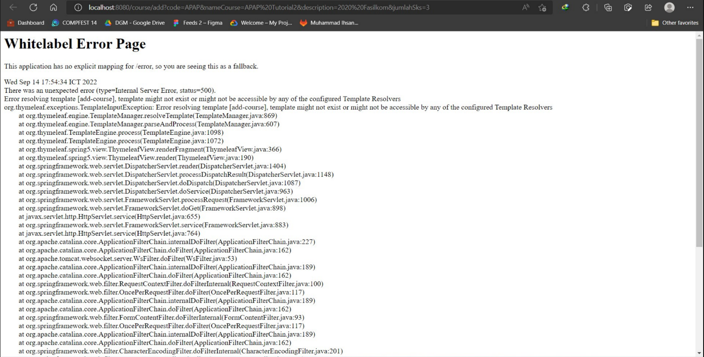
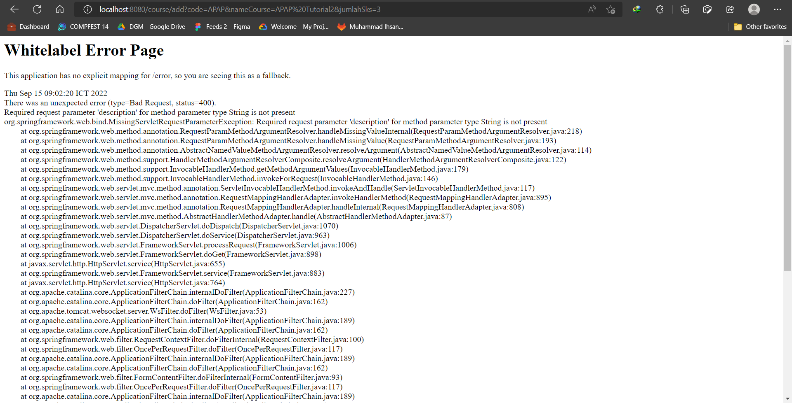
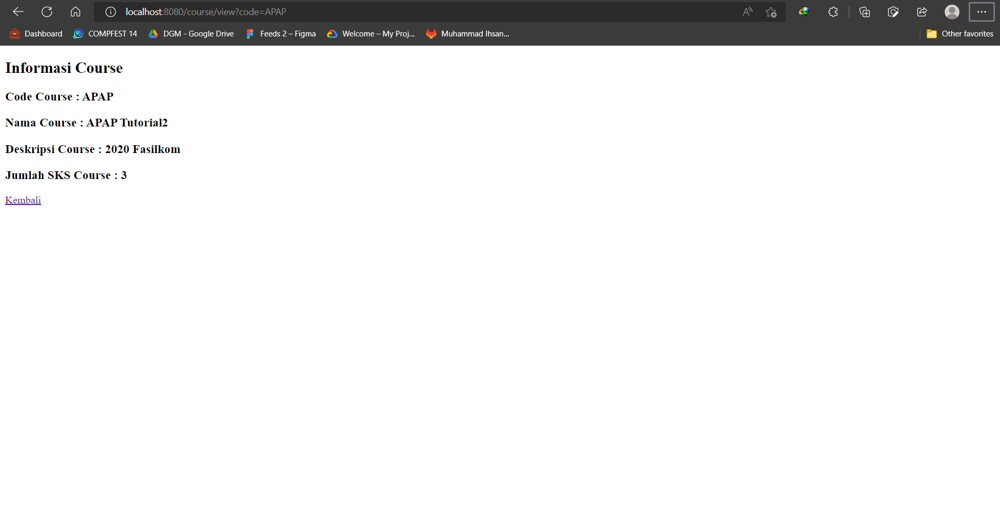
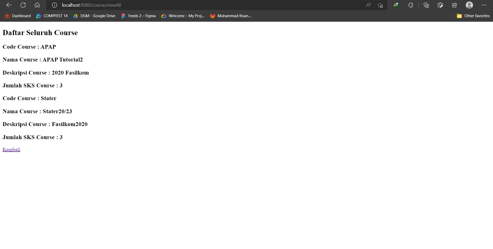

# Tutorial APAP

## Authors

* **Muhammad Ihsan Al Farisi** - *2006596693* - *APAP-B*

---
## Tutorial 2
**Pertanyaan 1: Cobalah untuk menambahkan sebuah Course dengan mengakses link berikut: 
http://localhost:8080/course/add?code=APAP&nameCourse=APAP%20Tutorial2&description=2020%20Fasilkom&jumlahSks=3.
Apa yang terjadi? Jelaskan mengapa hal tersebut dapat terjadi**
> Terjadi unexpected error. Hal ini terjadi karena templates "add-course" yang di-return oleh method addCourse tidak 
> ditemukan.

**Pertanyaan 2: Menurut kamu anotasi @Autowired pada class Controller tersebut merupakan implementasi dari konsep apa? 
Dan jelaskan secara singkat cara kerja @Autowired tersebut dalam konteks service dan controller yang telah kamu buat**
>Anotasi @Autowired pada class Controller mengimplementasikan konsep Injection. Anotasi tersebut memungkinkan kita sistem
> untuk menginjeksikan dependecies ke beans pada aplikasi. Pada aplikasi ini, @Autowired berfungsi untuk menginjeksikan
> dependencies pada CourseService agar dapat digunakan pada Controller.

**Pertanyaan 3: Cobalah untuk menambahkan sebuah Course dengan mengakses link berikut: 
http://localhost:8080/course/add?code=APAP&nameCourse=APAP%20Tutorial2&jumlahSks=3. Apa yang terjadi? Jelaskan mengapa 
hal tersebut dapat terjadi.**
> Seperti yang dapat dilihat pada gambar di bawah, penambahan Course gagal karena terdapat atribut yang tidak diisi 
> yaitu atribut description. Sistem tidak menghandle jenis penambahan Course dengan masukkan atribut yang tidak lengkap.

**Pertanyaan 4: Jika Papa APAP ingin melihat Course dengan kode APAP, link apa yang harus diakses?**
> Untuk melihat Course dengan kode **APAP**, kita dapat mengakses link sebagai berikut: 
> **http://localhost:8080/course/view?code=APAP**. Dengan catatan course dengan code terlampir telah ditambahkan.

**Pertanyaan 5: Tambahkan 1 contoh Course lainnya sesukamu. Lalu cobalah untuk mengakses 
http://localhost:8080/course/viewAll  , apa yang akan ditampilkan? Sertakan juga bukti screenshotmu.**
> Saya membuat Course lain dengan membuat dan mengakses 
> http://localhost:8080/course/add?code=Stater&nameCourse=Stater20/23&description=Fasilkom2020&jumlahSks=3.

## Tutorial 1
### What I have learned today
(Masukkan pertanyaan yang diikuti jawaban di setiap nomor, contoh seperti dibawah. Anda
juga boleh menambahkan catatan apapun di bagian ini)
### GitLab

1. Apa itu Issue Tracker? Apa saja masalah yang dapat diselesaikan dengan Issue Tracker?
   > Issue Tracker berguna untuk menulusuri isu-isu yang terjadi dalam pengembangan aplikasi. 
   > Issue Tracker dapat membantu pengembang untuk menemukan permasalahan beserta solusinya karena semuanya telah 
   > tertulis secara terstruktur. Hal ini tentu sangat berguna apabila pengembang membutuhkan solusi untuk masalah 
   > yang pernah terjadi sebelumnya sehingga proses pengembangan dapat berjalan dengan lebih efektif dan efisien.

2. Apa perbedaan dari git merge dan git merge --squash?
   > Git merge merupakan suatu perintah yang berfungsi untuk menyalin seluruh commit dari satu branch ke branch lainnya.
   > Sedangkan, git merge --squash merupakan suatu perintah untuk menggabungkan seluruh branch menjadi satu kemudian 
   > ditambahkan kepada branch lainnya.

3. Apa keunggulan menggunakan Version Control System seperti Git dalam pengembangan suatu aplikasi?
   > Penggunaan Version Control System seperti Git membawa beberapa keunggulan seperti:
    >- Pengembangan kode yang kolaboratif
    >- Pengembalian kode ke keadaan sebelumnya (apabila terdapat kesalahan)
    >- Membandingkan perubahan yang dilakukan dari waktu ke waktu

### Spring

4. Apa itu library & dependency?
    >- Library merupakan kumpulan kode yang dapat digunakan untuk fungsi-fungsi tertentu secara spesifik.
    >- Dependency, seperti namanya, merupakan suatu ketergantungan suatu program terhadap suatu komponen lainnya.

5. Apa itu Gradle? Mengapa kita menggunakan Gradle? Apakah ada alternatif dari Gradle?
   > Gradle  merupakan program yang dapat memudahkan pengerjaan pengembang dalam mengembangan suatu software. Contohnya
   > seperti untuk membuild dan mengompilasi kode secara otomatis. Dengan fungsi tersebut tentu kita membutuhkan gradle 
   > dalam pengembangan aplikasi agar lebih cepat.

6. Selain untuk pengembangan web, apa saja yang bisa dikembangkan dengan Spring framework?
    >- Database
    >- Apliaksi enterprise

   Dan produk-produk lainnya yang menggunakan JAVA serta membutuhkan automasi dalam pengerjaannya.

7. Apa perbedaan dari @RequestParam dan @PathVariable? Kapan sebaiknya menggunakan @RequestParam atau @PathVariable?
    >- @RequestParam
      Digunakan untuk mendapatkan parameter dari suatu URI.
    >- @PathVariable
      Digunakan untuk mendapatkan mengekstrak value dari URI>

### What I did not understand
(tuliskan apa saja yang kurang Anda mengerti, Anda dapat men-_check_ apabila Anda
sudah mengerti dikemudian hari, dan tambahkan tulisan yang membuat Anda mengerti)
- [ ] Penggunaan gradle
- [ ] Bagaimana cara aplikasi dapat berjalan (alurnya)
  (Anda dapat membuat tampilan code dalam README.md menjadi lebih baik. Cari tahu
  lebih dalam tentang penulisan README.md di GitLab pada link
  [berikut](https://help.github.com/en/articles/basic-writing-and-formatting-syntax))
